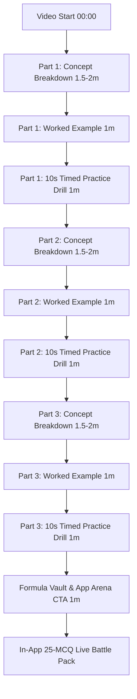

# 🎮 Aspirant Arcade — 36-Day Masterclass Video Engine & Production System

Welcome to the **Aspirant Arcade Masterclass Video Production Hub**. This directory provides the complete automated video generation engine, curriculum blueprint, master prompt system, and companion JSON data payloads for creating high-converting, high-energy educational videos for Indian competitive exam aspirants (GATE, PSUs, SSC, RRB).

---

## 📁 Directory Structure & Key Files

| File | Description |
| :--- | :--- |
| 🎬 **[`index.html`](file:///c:/Users/ps671/OneDrive/Documents/working/aspirant_arcade/aspirant_arcade_public/classes_video/index.html)** | Interactive, high-animation 16:9 HTML5 video player engine with particle physics background, KaTeX math typesetting, 10s circular countdown timers, canvas confetti, and automated YouTube metadata/timestamp generator. |
| 📋 **[`SPEED_MATH_MASTERCLASS_CURRICULUM_PLAN.md`](file:///c:/Users/ps671/OneDrive/Documents/working/aspirant_arcade/aspirant_arcade_public/classes_video/SPEED_MATH_MASTERCLASS_CURRICULUM_PLAN.md)** | Exhaustive 36-Day Master Curriculum covering all 5 Phases (Number Mechanics, Commercial Math, Kinematics & Work, Algebra & Sets, Geometry & Mensuration) with strict 3-Part Architecture. |
| 🤖 **[`CONTENT_GENERATION_PROMPT_SYSTEM.md`](file:///c:/Users/ps671/OneDrive/Documents/working/aspirant_arcade/aspirant_arcade_public/classes_video/CONTENT_GENERATION_PROMPT_SYSTEM.md)** | Master LLM prompt blueprint with strict JSON output schema, KaTeX formulas, voiceover scripts, and in-app practice pack generation instructions. |
| 📦 **[`day_01_data.json`](file:///c:/Users/ps671/OneDrive/Documents/working/aspirant_arcade/aspirant_arcade_public/classes_video/day_01_data.json)** | Complete, validated production JSON payload for **Day 01: Fractional Multipliers & Harmonic Invariance Law**. |
| 📦 **[`day_02_data.json`](file:///c:/Users/ps671/OneDrive/Documents/working/aspirant_arcade/aspirant_arcade_public/classes_video/day_02_data.json)** | Complete, validated production JSON payload for **Day 02: Vedic Speed Multiplication & Digital Roots**. |

---

## 🏛️ The 3-Part Architectural Standard (Every Episode)

Each 12–15 minute masterclass episode follows this battle-tested pedagogical structure:

---

## 🚀 How to Run & Preview

1. **Open the Player**:
   Open `index.html` in your browser (e.g., Chrome or Edge) directly via `file:///` or through any local dev server.
2. **Keyboard / UI Controls**:
   - `▶ Play` / `⏸ Pause`: Toggle continuous presentation playback.
   - `⚡ Speed Toggle`: Switch between `1x`, `2x`, `5x`, and `10x` playback speeds for rapid review.
   - `Chapter Selector`: Jump directly to any of the 10 stages (Parts 1–3 Concepts, Examples, Drills, Formula Vault).
   - `Copy YouTube Details`: One-click copy for the full description box with formatted timestamps and in-app practice URLs.

---

## 📲 App Ecosystem Integration
Every episode directly points students to the **Aspirant Arcade** gamified mobile/web arena:
- **Practice Pack ID**: `speed-math-01` through `speed-math-36`
- **Web Arena**: `https://aspirant-arcade.xyz/practice/speed-math-[DAY]`
- **App Download**: `https://aspirant-arcade.xyz/download`
